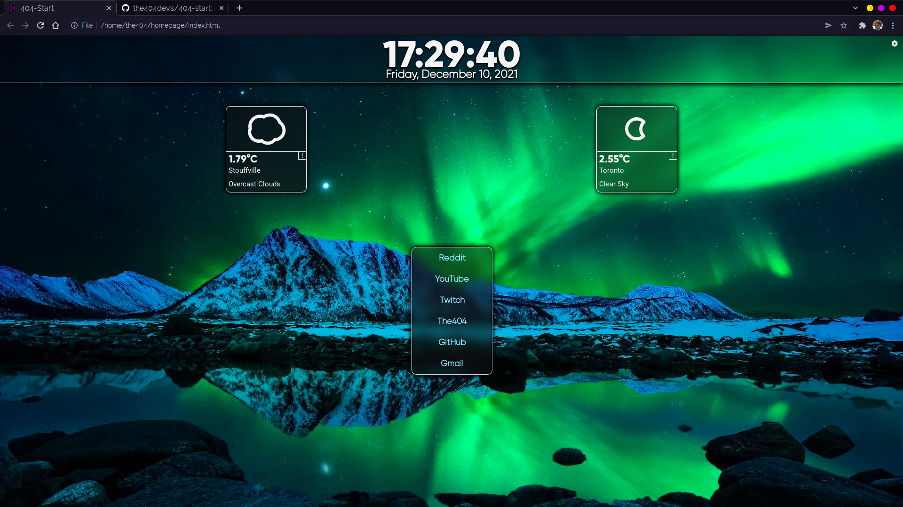
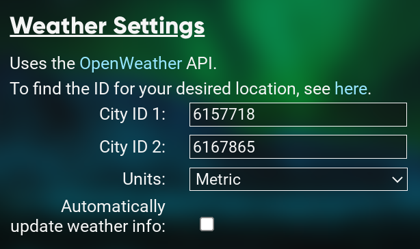
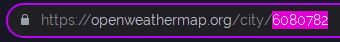

# 404-Start
A very customizable homepage that is in the process of being rewritten.

[Setup (Normal)](#setup-normal)

[Setup (Advanced)](#setup-advanced)

[Experimental New Tab Page (Chrome Extension)](#experimental-new-tab-page-chrome-extension)

[OpenWeather API](#openweather-api)

[Changelog](#changelog)

## Setup (Normal)
Just set https://start.the404.nl/ as your homepage in your browser.

## Setup (Advanced)
Head over to the [Releases page](https://github.com/the404devs/404-start/releases) and download the latest version (or just `git clone`).

Extract the .zip file to your preferred location, and open `index.html` in your browser. Once you set the URL of this page, you're all set!

## Experimental New Tab Page (Chrome Extension)
*Only supported when 404-Start is a local html file (advanced setup)*

I'm currently working on a Chrome extension that will make this start page your new tab page as well. This feature is still experimental. You've been warned.

In `js/config.js`, change the `ExtPath` variable to the path of `index.html` (You can just copy the url when on the homepage, the 'file://' prefix is required). This path is where the extension redirects the browser upon the creation of a new tab.

To enable the extension, perform the following steps:
- Head over to Chrome's extension settings page **chrome://extensions**.
- Enable "Developer Mode" with the toggle in the top-right corner.
- Hit the "Load Unpacked" button that appears.
- Choose the base directory of the homepage (the one containing `index.html`).
- Success! It should be working now.

- Once the extension is installed, you won't need to update it again, unless explicitly mentioned in the changelog.
- When you update 404-Start, you'll need to set the `ExtPath` variable again.

## OpenWeather API
404-Start uses the [OpenWeatherMap](https://openweathermap.org/) API to get weather information. When configuring the weather display, you'll need to provide the ID of the town/city you want to display.

To find this ID, head over to the [OpenWeatherMap](https://openweathermap.org/) website and search for the town/city you want to display.
You'll find the ID at the end of the page's URL. This is the value you need to put in the 'City ID' field.

## Changelog

### *2.0.2 (12/17/2021)*
------------------------
- Plenty of changes to customization and configuration options.
    - Can now change the spacing between the weather boxes (thanks mom).
    - Slider-ified some config values (`borderRadius`, `weatherBoxMargin`, `boxAlpha`, `headerAlpha`).
    - Can now change the background of the header (colour and transparency).
    - Moved around some of the config options to make more sense.
    - Optimized loading and saving of config from local storage.
    - Added `dataVersion` field to themes, future-proofing for breaking changes.
- Hacky fix to use the unused 'sleet' and 'windy' weather icons.
    - 'Wind' icon is triggered by wind speeds over 30km/h, but I'm no meteorologist.
    - 'Sleet' icon is triggered by checking if the forecast description contains the word "sleet".
- Fixes and such.
    - Restores old config upon failed import of valid non-theme JSON, so we don't accidentally save garbage as our config.
    - More CSS fixes.
    - Workaround for some Firefox-specific CSS issues.
- Made the update-checking more logical.
    - Automatic update checks only happen once per session, not every time the page is loaded (Fix for [#3](/../../issues/3)).
- We only monitor the `404CONFIG` key in local storage for changes, not the entire local storage.
- Refactored `weather.js`, to make it easier to manage, and possibly more efficient.
    - Wind direction is now shown correctly, instead the opposite of where the wind is blowing (See [v1.0.4](#104-04262021)).
    - Wind speed is also shown correctly, because math is hard.
    - Added some documentation on using OpenWeather and finding city ID.
- JS (mostly) documented.
- Moved fonts to `css/fonts/` subdirectory.
- Removed unused `css/sample-colors.css` file.

### *2.0.1 (12/10/2021)*
------------------------
- Reimplemented XKCD comic viewer.
    - Has the same functionality as the old one.
    - May or may not just be identical to the old one.
    - Moves upwards if link section is hidden.
- Added a warning if the selected background image is too large for the browser's local storage.
    - The max size is around 3MB, but I can't be bothered to check.
- CSS fixes.
- Date and time formats are now customizable, with the following expressions:
    - Date:
        - %M - Month (1-12), no leading 0.
        - %MM - Month (1-12), with leading 0.
        - %MMM - Month, abbreviated text ("Jan").
        - %MMMM - Month, full text ("January").
        - %d - Day (1-31), no leading 0.
        - %D - Day (1-31), with leading 0.
        - %y - Year, two digits ("21").
        - %Y - Year, full representation ("2021").
        - %w - Weekday, abbreviated ("Fri").
        - %W - Weekday, full representation ("Friday").
    - Time:
        - %h - Hour, 24-hour format.
        - %hh - Hour, 12-hour format, no leading 0.
        - %hhh - Hour, 12-hour format, with leading 0.
        - %m - Minutes.
        - %s - Seconds.
        - %a - AM/PM indicator.
- Lots of general code cleanup. CSS split into multiple files, removed many redundant rules.
- Removed unused JS files.
- Added ability to export the current configuration to a JSON file, and the ability to import config from said files.

### *2.0.0 (12/09/2021)*
------------------------
- Completely rewritten.
- Layout has been changed to be simpler.
- Killed off the todo list.
- Removed accounts and firebase storage.
- All config is saved in the browser's local storage.
- Removed some unnecessary code and files (not all, more cleaning needed).
- Work isn't done yet, more features to come.
    - Reimplement XKCD comic viewer.
    - Ability to import/export themes.
    - Custom date/time formats.
    - Ability to customize fonts.
    - Bugfixes to make it not look as awful on Firefox.

### *1.0.5 (07/08/2021)*
------------------------
- Added option to auto-refresh weather info every 10 minutes.

### *1.0.4 (04/26/2021)*
------------------------
- Fixed a long-standing bug with wind direction arrows pointing in the opposite direction of where they should be.
    - As of 2.0.2 (12/17/2021), I've realized it was actually fine to begin with, and this "fix" made it wrong, lmao.
- Added hover text to buttons that don't have any text on them, like close buttons, etc.
- Added a button to refresh weather info.
- You can now press `Enter` in the password fields of the login & register forms to submit them.

### *1.0.3 (04/18/2021)*
------------------------
- Fixed a bug regarding the colour of the animated weather icons.
- Implemented the icon I made in 1.0.2, since I forgot.
- Made the path to the user's pywal css file configurable in the settings menu.
    - Honestly, I'm not sure why I didn't do this in the first place.
    - Some documentation changes to match this change.

### *1.0.2 (03/18/2021)*
------------------------
- Fixed bug where missing fields in the account db would break everything and prevent the page from loading correctly.
    - Missing fields are now given default values.
- Fixed very poorly coded event deletion (Thanks 2019 me).
- Login/Register forms now show error messages when something goes wrong, inputs are cleared when forms are closed.
- Slight cleanup of `js/weather.js`, much more to come.
- New icon, still not 100% happy with it.
- Link settings made a bit more user-friendly, config for only 1 link is shown at a time, dropdown allows user to choose which one is shown.
- Firestore rules fixed, only logged-in users can read/write, and only to the collection that matches their UUID.

### *1.0.1 (03/13/2021)*
------------------------
- 404-Start now (sort of) differentiates between online and local modes.
    - Additional settings are shown in local mode.
        - Toggle automatic update on/off
        - Button for manual update check
        - Toggle Pywal colours on/off (still need to set the path in `config.js`, for now)
    - Automatic update check on page load. This will probably get annoying, so in the future I should probably make it once per session.
- Added the ability to change UI colours.
    - Background colour: used for the background of all components
    - Foreground colour: used for text, borders, etc.
    - Highlight colour: used for buttons when hovered over
    - Header colour: used for the header with the time and date
- There are only 4 colours for now, but more may come in the future.
- Added ability to toggle inverting the colours of the XKCD comic, for dark themes.
- Some styling changes.
- Added more words to README setup instructions.

### *1.0.0 (03/12/2021)*
------------------------
- After nearby 2 years, we've finally reached a full release!
- Remove old Firebase events db
- Added account-based Firestore db, stores all preferences and things per-user.
    - Since everything is now account-based, you can easily sync settings cross-device.
- Added new config modal box.
- The following things are now configurable:
    - Left-side links (icons, text, url)
    - Weather locations and display units
    - Toggle XKCD display on/off
    - Date/time formats
- Migrated to OpenWeather API, since DarkSky is being depreciated at the end of 2021.
- Still missing configurable colours, that will come soon™
- Code is very messy, will need lots of cleanup.

### *0.1.7 (08/07/2020)*
------------------------
- Force MM/DD/YY date in header.

### *0.1.6 (06/03/2020)*
------------------------
- Added missing changelog to README.
- Rewrote CSS to make it easier to navigate.
- Added fonts, since there's no way to guarantee they're installed on the user's system.
- Changed page title from 'Welcome' to '404-Start' for consistency.
- Added a tentative icon for this project.

### *0.1.5 (05/25/2020)*
------------------------
- Configuration process greatly simplified.
    - All config now done within `config.js`, instead of across multiple files.
    - README changed accordingly.
- Added experimental Chrome extension that will make 404-Start the new tab page.
    - See setup process in README
- Created local copies of external JS, improving load times as we no longer need to fetch JS from other sites.

### *0.1.4 (05/08/2020)*
------------------------
- Customizability changes.
    - Removed hardcoded values, streamlining customization
    - Added setup instructions to README
- Added sample colours. These are used as a fallback if no `pywal` colours exist.
- Minor fix to XKCD fetching.
- Plenty of little things from the past few months.

### *0.1.3 (10/05/2019)*
------------------------
- Removed redundant files.
- CSS changes.

### *0.1.2 (09/18/2019)*
------------------------
- Project moved to Github
- Minor tweaks.

### *0.1.1 (07/26/2019)*
-----------------------
- Added modal to display weather warnings, etc.
- Added XKCD viewer at the bottom, displaying the latest webcomic from xkcd.com

### *0.1.0 (03/26/2019)*
-----------------------
- Added todo list functionality using Firebase.
- Weather display CSS tweaked.

### *0.0.1 (03/18/2019)*
-----------------------
- Initial version
- Added weather display using DarkSky API and Skycons.
